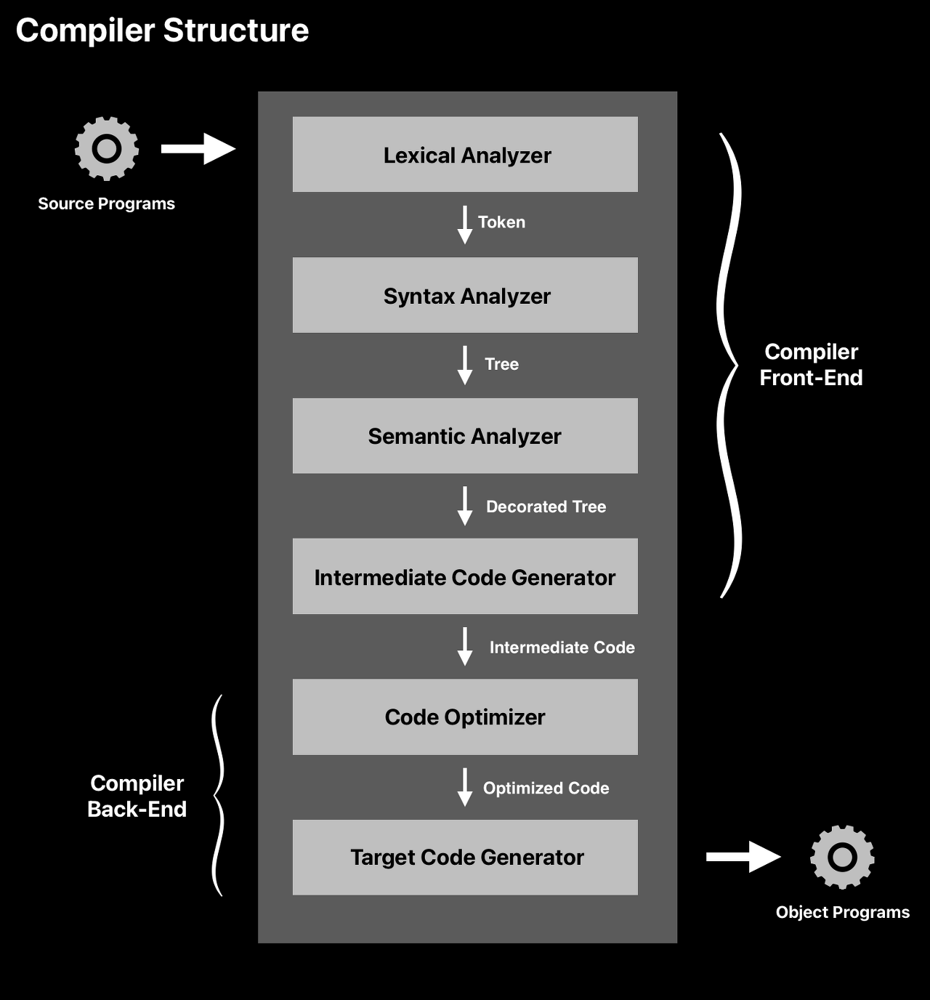

# 프레임워크를 위한 JAVA (1) - JAVA 이야기

**1. JAVA 개발 환경**

    - JVM 필요  → 실행 환경 : JRE : java 만 있음
    - JRE + 개발툴 → 실행 환경 : JDK : java + javac
    - 최소 8 버전 이상을 설치
    - path 설정

**2. Build Tool**
- 자동으로 빌드 해주고 실행해주는 그런 툴을 만들면 좋겠다.
- Build Tool : Ant, Maven, Gradle

**(숙제) 직접 Gradle 설치하기**

- gradle init 통해서 프로젝트 생성
- gradle tasks로 테스트 목록 확인
- 실행 : gradle build로 빌드 → gradle run로 실
- plugin : 미리 만들어 놓은 task set.

→ 통합적으로 해주는 것이 없냐> → IDE

**3. IDE : 통합 개발 환경 → 생산성 향상**
- 주로 사용하는 IDE: Eclipse, Intellij

**(숙제) intellij 설치하기**

- 유용한 단축키
    - alt + enter  / Option + enter: 빠른 수정
    - ctrl + 1 / Command + 1 : 왼쪽으로 커서가 옮겨진다.
    - ctrl + n / Command + n : 새로운 파일 생성
    - shift + shift : 파일 이름 검색
    - alt + up/down  / Option + up/down : 단계별 블록 지정
    - shift + ctrl + alt + t | ctrl + t : 리펙토링 메뉴
    - shift + ctrl + a | shift + command + a : action 검색
    - Intellij Cheat Sheet 검색 해보기 → 버전 별로
    
**4. 초보 개발자가 알면 좋을 정보**

**(1) Coding Convention**

- 팀이나 회사, 개발 그룹에서 정해서 사용한다
- 안 정하는 경우 → 일반적인 자바 코딩 룰을 따른다.
    - 클래스명은 대문자로 시작한다.
    - 메서드나 변수 명은 소문자로 시작한다.
    - Indent : 들여쓰기
        - Tab, space가 있다.
        - 단, 섞어서 쓰면 안된다.

**(2) Reference**

- Java를 하면 포인터를 몰라도 된다. (X)
- java에서는 alloc/free를 개발자가 일일히 신경쓰지 않아도 된다 (O)
- Java에서는 포인터 대신 레퍼런스라는 개념이 있다.
- Java에서는 모든 것이 레퍼런스 값이다.
    - 8개의 primitive type을 제외하고.
    - array는 reference로 취급한다.
- Call by value / Call by reference

**(3) Constant Pool**

- String을 특별하게 취급한다. → Constant Pool을 이용한다.
- String에 대해서는 +=을 사용하지 않는 것이 좋다.
- StringBuffer를 사용하자

## 숙제 StringBuilder와 StringBuffer의 차이점
StringBuilder와 StringBuffer의 차이
 - 가장 큰 차이점은 **동기화 유무**
 - StringBuffer : 동기화 키워드 지원 → 멀티쓰레드 환경에서 안전하기에 멀티쓰레드 환경에서 적합하다.
 - StringBuilder : 동기화 지원 하지 않는다 → 단일 쓰레드에서의 성능은 더 뛰어나다. 하지만 멀티쓰레드 환경에서 사용하는 것은 적합하지 않다.

**(4) Object 클래스**

- 모든 객체의 최상위 객체
- 모든 객체에는 Obejct의 메서드 호출 할 수 있다는 말.
- Object에 어떤 메서드가 있는지, 어떤 기능을 수행하는 지 알아야함.
- `toString()`, `equals()`, `hashCode()`

**(5) Git**

- git을 사용하는 것이 기본기.
- 명령어로 익히실 필요는 없다.
    - 어떻게 사용하는지
    - tool을 사용해서 활용하면 된다.
        - github desktop, source tree
- .gitignore 파일 잘 활용해 주었으면 좋겠다.
    - 포함되지 않아야 할 파일들이 잔뜩 있다면 감점 요소
    - 필드결과, 바이너리, 제너레이트 가능한 파일들, 로컬설정, 키/보안관련 파일들 있으면 센스 없어 보임.
        - *.class, *.jar, build
        - gradle 폴다, gradlew 같은 파일 (gradle wraaper로 얼마든지 생성가능)
- 안올려도 되는 파일들을 .gitignore 파일에 기록해서 관리하는 것이 좋다.
    - [gitignore.io](http://gitignore.io) 사이트 활용
        - 환경 설정 → gitignore 파일 설정 해준다.

## Runtime Constant pool과 String constant pool의 차이

### Runtime Constant Pool
Method Area는 모든 스레드가 공유하는 영역으로 JVM이 시작될 때 생성된다.
이 안에는 JVM이 읽어 들인 각각의 클래스와 인터페이스에 대한 **Rumtime Constant Pool**, 필드와 메서드 정보, 메서드의 바이트코드 등이 보관된다.
- 위치 : 메모리의 Method Area

먼저 자바 컴파일러를 이해해야 한다.

컴파일러에도 Front-end와 Back-end가 있는데 우리가 아는 웹 개발에서의 의미와는 다르다.
- Front-End : 프로그래밍 언어에 의존적, 기계에는 독립적
- Back-End : 프로그래밍 언어에 독립적, 기계에는 의존적

컴파일러의 Front-End는 개발자가 작성한 소스 코드를 분석하여 의미를 파악하는 역할이다.

 Java로 작성되었는지 C로 작성되었는지에 따라 다르기 때문에 프로그래밍 언어에 굉장히 의존적이다. 
 
 Back-End는 Front-End에서 분석한 내용을 가지고 기계가 이해할 수 있도록 기계에 맞게 기계어(바이너리 코드)로 바꿔야 한다. 
 
 따라서 프로그래밍 언어에는 독립적이지만, 기계에는 의존적이라는 의미이다.

.png)
정리하자면 
- Front-End : 프로그래밍 언어에 의존적, 기계에는 독립적 ( = Java Compiler 부분 )
- Back-End : 프로그래밍 언어에 독립적, 기계에는 의존적 ( = JVM 부분 )
  => 위 그림과 같이 컴파일러를 통해서 bytecode로 변환한다.

Lexical Analyzer → Syntax Analyzer → Sementic Analyzer → Intermediate Code Generator를 거치면서 token 단위로 쪼개고, Abstract Syntax tree 만들고, 의미적으로 유효성 확인하고, `Symbol Table`을 이용해 **클래스나 인터페이스별** `Constant Pool`을 만드는데 사용한다.
 
 **Symbol table**은 컴파일러가 변수의 의미론적인 내용을 추적하기 위해 유지되는 데이터 구조인데, 변수의 스코프, 바인딩 정보, 변수의 인스턴스 등 다양한 엔티티의 정보를 저장하는 것이다

이 **Symbol table**을 기반으로 만들어진 Constant Pool(상수 풀)은 Byte Code(.class) 파일에서 필요한 Literal Constant, Type Field(Local Variable, Class Variable), Class 및 Method로의 모든 Symbolic Reference 등을 모아놓은 데이터 구조이다.
**이 constant pool은  ByteCode(.class) 파일 내에 있다.**
클래스나 인터페이스가 JVM에 의해 로드 될 때마다 해당 클래스 또는 인터페이스의 상수 풀이 내부적으로 만들어지는데, 내부적으로 만들어져서 런타임 데이터 구조를 가지는 상수풀이 바로 `Runtime Constant Pool`이다.
즉, `Constant Pool`과 `Runtime Constant Pool`은 클래스, 인터페이스 별로 각각 따로 존재한다.

정리하자면, Constant Pool은 **클래스 파일 내부**에 있고, 클래스 파일을 동적 로딩하여 **JVM에 의해 메모리에 올라가면서 메서드 영역에 존재하는 상수 풀의 런타임 표현이 Runtime Constant Pool이라는 의미**

### String Constant Pool
- Java의 String은 "불변 객체"라는 특징이 있다. 그래서 클래스 파일 Constant Pool에 리터럴 String이 있다면, 문자열의 복사본을 String Pool에 하나만 저장하여 할당된 메모리 양을 최적화 하는 것이고 이 과정을** intern**이라고 한다. String Pool에 문자열 리터럴을 캐싱하고 이후에 재사용하게 되면 힙 메모리 영역을 효율적으로 사용할 수 있다는 의미이다.
- Heap 영역에 있는 String 객체를 위한 특수한 메모리 영역이다.
- Heap에 있어서 문자열 객체가 더이상 참조되지 않으면 GC의 대상이다. 

### 정리
1. Constant Pool (상수 풀) - 클래스 파일에 존재

- Byte Code(.class) 파일 내부에 존재하는 constant_pool[] 테이블이다.
- Literal Constant, Type Field(Local Variable, Class Variable), Class 및 Method로의 모든 Symbolic Reference 등을 모아놓은 데이터 구조이다.
 
2. Runtime Constant Pool (런타임 상수 풀) - Method Area에 존재

- 클래스로더에 의해 클래스 파일이 동적 로딩되면서 Method Area에 생성되는 Constant Pool의 런타임 데이터구조이다.
- Java 7의 Perm 영역이 없어지고 Java 8부터는 Metaspace 영역이 생기면서 Metaspace의 메서드 영역에 저장된다.
- String Pool, Static Object는 런타임 상수 풀이 아닌 Heap 영역에 저장되어 최대한 GC의 대상이 되게 한다. 
 

3. String Pool ( = String Constant Pool, 문자열 풀 ) - Heap에 존재

- Heap 영역에 있는 String 객체를 위한 특수한 메모리 영역이다.
-Heap에 있어서 문자열 객체가 더이상 참조되지 않으면 GC의 대상이다. 

**내가 잘 못 알고 있었던 것 : 
literal에 대한 정보를 가진 constant pool이 stack에 존재한 다는 것.
stack에는 각 클래스의 Runtime constant pool에 대한 reference를 가지는 것이였다!**
