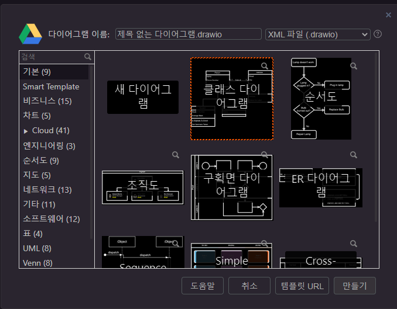
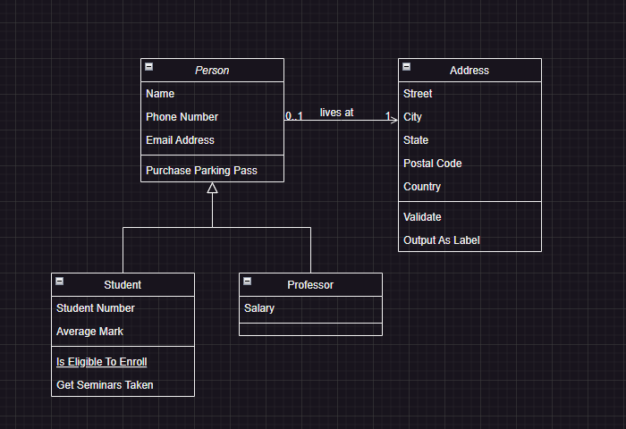
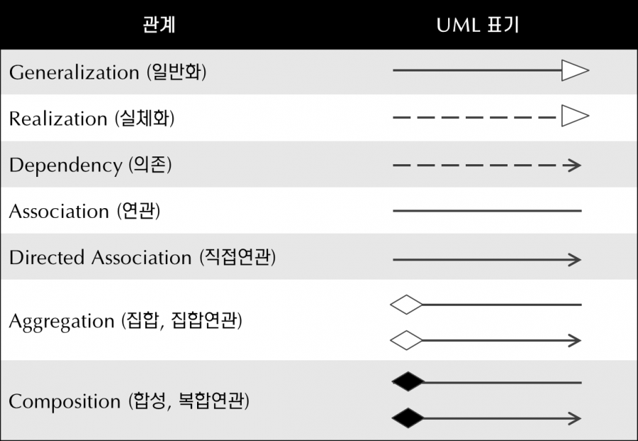

# 6월 3일 강의 - JAVA

# 프레임워크를 위한 JAVA - OOP 이야기

## 1. 객체 지향 프로그래밍

- JAVA : 객체 지향 언어다! → 객체 지향적 프로그래밍을 해야한다.
- 객체 지향 프로그래밍 : 프로그램을 객체로 구성하는 것.
- 등장 : 프로그램이 거대화 하면서 등장.
- 아이디어 : 어떻게 큰 프로그램을 만들 것인가? 더 효율적, 관리하기 좋을 것인가?
    - 해결책 : 작게 나눠서 만들고 합쳐
- 프로그램의 동작을 객체들에게 나눠서 수행 (잘게 쪼개서 객체 들에게 분산 → 객체들로 구성하는 것이 객체 지향 프로그래밍)
- 개념적인 용어 : 객체 / 기술적인 용어 : class, instance
- 객체는 작은 기능을 수행 → 객체와 객체는 서로 협력

**⇒ 일을 잘게 쪼개서 객체에 (책임을) 위임하고, 서로 협력하게 만드는 것 ⇒ 객체 지향 프로그래밍**

- 객체를 서로 구분할 필요가 있다.
    - type(형)으로 구분한다.
    - `String str = "Hello World"` → String 객체를 하나 만든 것.
    
- 타입 만들기 : class 만들기

```java
package com.programmers;

import java.lang.*;

class MyObject extends Object implements Runnable{
    // 책임 부
    // 필드 영역
    private int a = 0;
    // 메소드 영역
    private void run() {
        a += 1;
    }
}

	MyObject obj = new MyObject();    // 인스턴스 생성

```

## 2. 객체 지향의 특성

### (1) 캡슐화

1. 완성도가 있다.
    - 기능을 수행하는 단위로서 완전함을 갖는다.
    - 기능을 수행하기 위해서 외부의 의존성을 가질 수 있지만, 없도록 하는 것이 맞다. 있다 하더라도 결합을 느슨하게 만들기. (스스로 동작하는데 완전함을 갖는다.)
2. 정보가 은닉되어 있다.
    - 객체의 정보가 밖에서 접근하거나, 밖에서 객체 내의 정보에 접근하지 못하게 한다.

⇒ 객체는 스스로 동작 할 수 있는 환경을 갖고 있어야 한다.

외부에 의존하거나, 외부의 침략을 제한하여야 한다.

```java
// 접근 지정자
class Human{
    private Heart heart;
    private Blood blood;
    private Gene gene;

    Blood donate(){
        return null;
    {
}

Human human = new Human();
// human.heart.stop(); 접근 차단

class Child extends Human {
    void run() {
        super.heart;
        super.heart;
        super.heart;
    }
}

```

⇒ 접근 지정자 (접근 제어자)를 통해서 캡슐화를 제한한다.

접근 제어자

- private : 객체 소유
- (friendly) : 같은 패키지 내에서 접근 가능. → default의 다른 이름 ( 패키지 가시성)
- protected : 같은 패키지 접근 가능 + 상속된 객체에서도 접근 가능.
- public : 모두 다 접근 가능.

`protected` 는 사용하는 방법이

다른 패키지에서 상속 한 객체를 **통해서** 접근 가능한 것이다!!

아래 예시에서 그 차이를 확인하자! 상속한 객체에서 접근 가능한 것이 아니라, **상속한 객체를 통해서** 접근 가능한 것이다!

```java
package test;  // 패키지가 서로 다르다.

public class Test {
    protected String sample= "Junho";
}
```

```java
package test.protect;  // 패키지가 서로 다르다.

import test.Test ;

public class Example extends Test {  // Test를 상속했다.
    public static void main(String[] args) {
        Example example = new Example();
        System.out.println(example.sample);  // 상속한 클래스의 protected 변수는 접근이 가능하다.
        Test test = new Test();
//        System.out.println(test.sample);   // 접근 불가!
    }
}
```

### (2) 상속

- 상위, 부모, super, [추상 객체]
- 하위, 자식, this, [구체 객체]

- **오해** : 공통된 기능을 여러 객체에게 전달하고 싶을 때
    - **기능으로서 상속하면 안된다!**
- 동물 > 포유류 > 사람 > 남자 > 짱구 → **상속은 추상과 구체의 관계가 올바른 방법!**
- 남자 > 남자 어린이 (X) **잘못된 방식!**

### (3) 추상화

- 추상화된 객체 : 추상체
- 구체적인 객체 : 구상체
- 객체간의 관계에서 상위에 있는 것이 항상 하위보다 추상적이어야 한다.

```java
// 의미적 추상체
class Login {
    void login() {
    }
}

class KakaoLogin extends Login {
    void login() {
    }
}
```

```java
// 추상 기능을 가진 객체
abstract class Login {
    abstract void login();
}

class KakaoLogin extends Login {
    @Override
    void login(){
    }
}
```

```java
// 객체 자체가 추상적
interface Login {
    void login();
}
class KakaoLogin implements Login {
    @Override
    void login(){
    }
}
```

### (4) 다형성

- 형(type)을 여러가지로 표현할 수 있다. (추상 클래스로도 표현 가능)

```java
class KakaoLogin implements Login {
    void kakao() {}
    @Override
    void login(){
    }
}

interface Portal {
    void portal();
}
class KakaoLogin implements Login, Portal {
    void naver() {}
    @Override
    void login(){
    }
    @Override
    void portal(){
    }
}

KakaoLogin k = new KakaoLogin();
Login k = new KakaoLogin();

Login login = new Login();
Login login = new KakaoLogin();
Login login = new NaverLogin();    // login만 접근 가능
Portal portal = new NaverLogin();    // portal만 접근 가능
```

→ 타입이 `Login`이면모두 `login()` 기능만 제공.

정보를 차단 해 줌으로서 인터페이스를 통해서 막아준다.

같은 객체이지만 누가 접근하느냐에 따라서 필터링 한 기능만 제공해준다.

→ 캡슐화가 되기 위해서 남에게 접근하거나 빼오면 안된다.

→ ‘객체가 협력해서 일한다’를 안전하게 해준다.


## 3. 객체 지향 설계

어떻게 하면 객체 지향을 잘 할 수 있는 것이냐?

### (1) UML

- 객체지향 프로그래밍 : 기능을 객체에게 나눠서 수행시킨다.

→ 객체를 어떻게 구분했다. (== 일을 어떻게 분할 했다.)

→ 객체간의 관계가 어떻게 구성되었다. (객체간의 연관관계가 어떠하다.)

- 설명하기 위한 도구 : UML
    - Usecase Diagram
    - Sequence Diagram
    - Package Diagram
    - **Class Diagram → 많이 쓰**
- Tool :
    - [https://draw.io](https://draw.io)
    - https://staruml.io/
    - PowerPoint / Visio (마이크로소프트)
    - 그림판
- draw.io의 예시





- 필드와 메서드로 이루어져 있다.
- 화살표는 상속
- 점선은 implements



일반화 : 추상체이다. 상속했다.

실체화 : implement

다이아몬드 : 반드시 존재해야 할때.

연관 있는데 뭔지 모르겠다 → 연관

1번이 2번을 사용하는 경우 : →

1번이 2번을 소유하는 경우 : 다이아몬드 →

### (1) 어떻게 하면 객체를 잘 나누고 연관지을 수 있느냐?

- 객체지향 설계를 하는 5가지 원칙
    - S : SRP : 수정이 필요할 경우 수정되는 이유는 하나 때문이어야 한다.
    - O : OCP : 수정에는 닫히고, 확장에는 열려있어야 한다.
        - 객체가 수정, 변경될 필요가 있으면 수정하지 말고 확장 할 수 있게 기능을 만들어라.
    - L : LSP : 추상 객체로 사용되는 부분에 구상 객체가 들어가도 아무 문제가 없어야한다.
        - 상속을 기능의 공통 기능의 확대, 쉽게 전달하기 위해 사용하면 깨진다.
    - I : ISP : 인터페이스 분리 원칙.
        - 위 경우 같이 Login, Portal 나눠서 써라. 인터페이스는 한 기능, 책임만 가지고 있어야 한다.
    - D : DIP : 의존 역전 원칙

SOLID 너무 추상적이다. 구체적인 것을 달라

- 원칙에 따라서 설계 해 보았다 → 여러가지 경우에서 공통점이 보였다.
- 공통점들을 모아놨다. → 책 : **디자인 패턴**
- Gang of Four (GoF) 4명이서 디자인 패턴 책을 출판함. (1994)
- 23가지 패턴
- [https://refactoring.guru/](https://refactoring.guru/) 참고하기

**** (숙제) 23가지 패턴에 대해서 정리하기**

**개인적 궁금증**

- composition에 대해서

상속은 확실한 `is-a` 관계인지 고민해보고 상위 클래스가 변화에 의해 결함이 생겼을 경우 하위 클래스까지 전파되어도 괜찮은지 철저하게 확인하고 상속을 사용해야 한다.

캡슐화를 깨뜨릴 수 있기 때문에 코드 재사용이 아닌 반드시 확장이라는 관점에서 사용해야 한다.

애매할 때에는 조합(Composition)을 사용하자.

상속의 단점

- 캡슐화를 위반한다. → 부모클래스가 변경되면 자식 클래스가 치명적 오류 발생 가능.
- 설계에 유연하지 못하다.
- 다중상속이 불가능하다.

Composition이란 기존 클래스를 확장하는 대신, 새로운 클래스를 만들고 private 필드로 기존 클래스의 인스턴스를 참조하게 하여, 기존 클래스가 새로운 클래스의 구성 요소로 쓰인다는 뜻에서의 설계.

- 이러한 방식을 forwarding(전달) 한다고 하며, 새로운 클래스는 기존의 클래스의 구현 방식을 벗어나고 기존 클래스에 새로운 메서드가 추가되더라도 전혀 영향을 받지 않는다.
- 기존 클래스가 새로운 클래스의 구성 요소가 되는 (`has-a` 관계 일때 사용한다.)
- 디자인 패턴 -decorator 패턴과 관련있음. 찾아보기 (https://dev-cool.tistory.com/22)