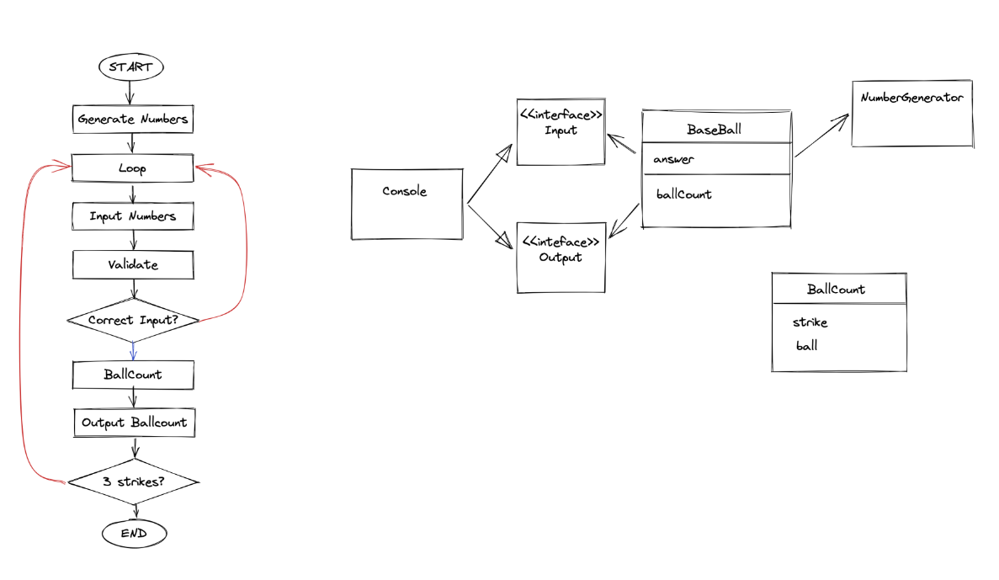

# 6월 7일 - 프레임워크를 위한 JAVA (5)

# 실습 프로젝트

## 외부 라이브러리 사용하기

- gradle : Build Tool
    - 빌드한다 / 실행한다.
    - 외부에 의존성이 있는 라이브러리 설
- 라이브러리 검색
    - [https://search.maven.org/](https://search.maven.org/)
- java faker, lombok 설치

## 설계하기

- 숫자 야구 게임 설계
- 요구사항 파악하기
    - 게임의 룰을 이해
    - 동작환경, 데이터 범위
        - 3자리 숫자 사용 (확장 가능하다.)
        - 중복된 숫자를 사용하지 않는다.
        - 1~9를 사용한다. (0 사용하지 않는다)
        - Console 상에서 동작하는 프로그램 제작
- 일을 객체로 나누기 / 객체를 연관짓기
    - Engine
        - BaseBall
        - NumberGenerator
        - Input
        - Output
    - Application
        - app
        - Console
        - FakerNumberGenerator
- 핵심로직 설계하기
    - Flow Chart
    
    
    

## 구현하기